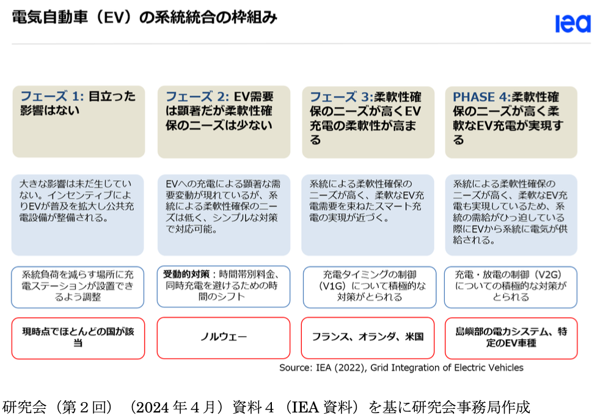
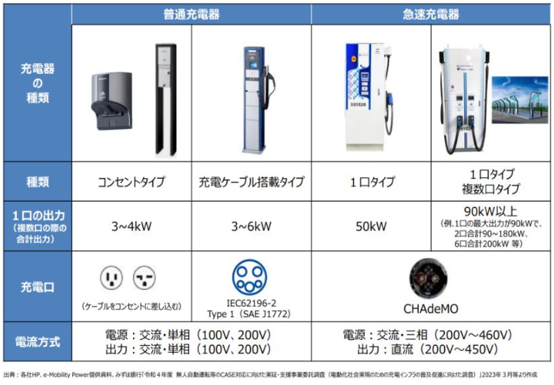
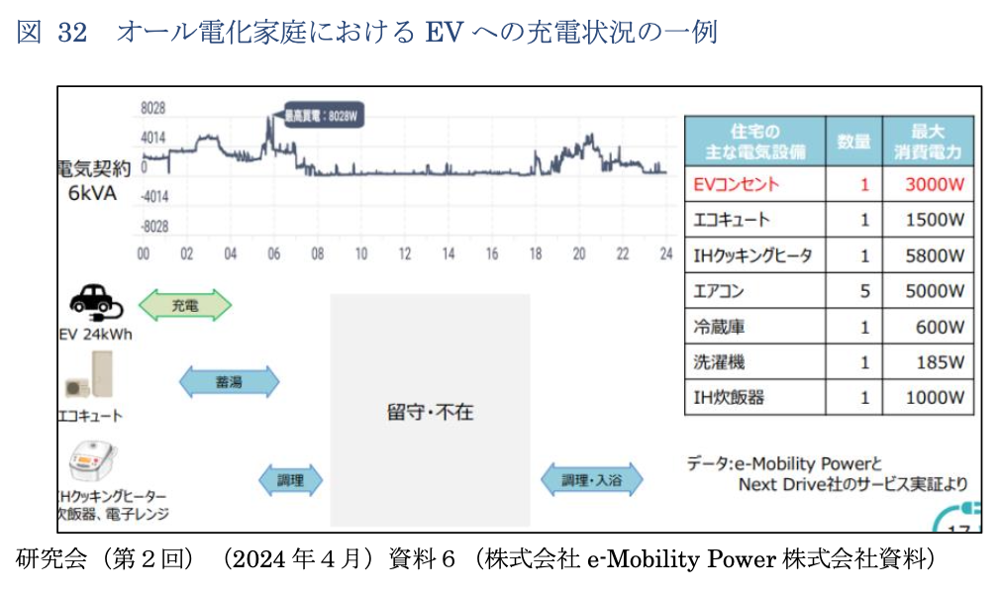
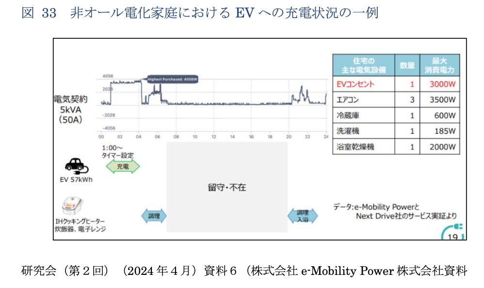

# 局所的電⼒需要増加

### EVの充電需要と送配電ネットワーク

1Y22F152  
矢澤駿

  
    next page<carbon:arrow-down class="inline"/>
  

  <button @click="$slidev.nav.openInEditor()" title="Open in Editor" class="text-xl slidev-icon-btn opacity-50 !border-none !hover:text-white">
    <carbon:edit />
  </button>
  <a href="https://github.com/slidevjs/slidev" target="_blank" alt="GitHub" title="Open in GitHub"
    class="text-xl slidev-icon-btn opacity-50 !border-none !hover:text-white">
    <carbon-logo-github />
  </a>

---

# 要約範囲
***

**局地的電⼒需要増加と送配電ネットワークに関する研究会 報告書** p49~68

# 目次
***
電気自動車（EV）の充電需要と送配電ネットワークの調整に関する現状と課題、さらに将来的な方向性

1. EVの普及に伴う送配電ネットワークへの影響
2. 充電インフラの課題と改善策
3. 海外の事例や政策
4. 日本国内の適応策の提案

---

# 1 EV充電需要の現状
***
- 現在の**日本**ではまだ、EV保有台数は全自動車の1%以下であり、送配電ネットワークへの影響は限定的
- **日本**では2035年までに新車販売で電動車100%を目標としている(カーボンニュートラル)

</img>

<!--
EVの系統統合の枠組み
Phase1 
  - EVの若干の普及による電力需要の影響があまりないフェーズ
  - 現時点でほとんどの国がここに該当する
Phase2
  - EVの普及が広がり、電力需要に顕著な影響が現れるフェーズ。とはいえ若干のため、簡単な対策が必要、という程度。**時間帯別料金**等を用いて、充電が集中しないようにする対策がなされている。当座を凌ぐ対策でやや受動的な対策。将来的にはより根本的なシステム的な対策を求められる
  - ノルウェーなどがこの段階にあたる
Phase3
  - EVがさらに普及して、より柔軟性の高い充電機構を確立する機運が惹起される。充電タイミングの制御(**V1G**)について積極的な対策が求められる。
  - フランス、オランダ、アメリカなどがこの段階にある
Phase4
  - 系統toEVとEVto系統双方向の電力供給が可能になった段階。充電・放電の制御(**V2G**)について積極的な対策が求められる。こうなればもう安心
  - 国全体ではないが、特定のEV車種がこれを実現している
-->

---

# 2.1 EV充電需要の特徴と課題
***

- EVユーザーの主な充電場所
  - 家庭充電、商業施設充電、高速道路のSAや道の駅
- 課題
  - 急速充電と普通充電の使い分け
  - ピーク電力タイムに充電 $\rightarrow$今の所、問題はない
  </img>

$\rightarrow$ **急速充電器**だけ設置しまくればいいのでは？

急速充電器を設置すると、
- 一気に需要が重なるタイミングが来る

また急速充電器を設置しても、
- 最大出力が発生する時間帯は限られる

充電器の設置は地域の配電ネットワークにも依存するところがある。

$\rightarrow$ 同一敷地内での充電管理も重要

<!--
EVユーザーの主な充電場所には、家庭、商業施設、高速道路のサービスエリアや道の駅などがある。
これらの課題としては

- 急速充電と、普通充電の使い分け
- ピーク時間帯でのEV充電の重なり
が挙げられる。後者は多少重なったとしても、人口減少に伴う世帯数減少による需要減少と相殺される範囲の増加であれば、配電ネットワークへの影響は発生しないと考えられ、また
うまく時間をずらすことで防ぐことが可能なため、今のところ問題はないとされている

EVへの充電設備はその需要によって急速充電器と、普通充電器があり、またEV車種によっても充電性能は異なるため様々な需要をクリアするような充電設備の確立が重要となってくる。

一般的には、家庭の車庫や宿泊施設の駐車
場、比較的長期間の停車が見込まれる観光地や商業施設等では普通充電器が普
及し、高速道路のサービスエリアやコンビニ、道の駅では急速充電器が設置さ
れるといった傾向になることが想定される。

ここで、急速充電器だけを設置すればいいという疑問も浮かびますが、
- 別にゆっくり充電してもいい場面で、高電圧を要求するため、各地でそれが起こると電力逼迫する
- 台数に比例して最高出力が増大する可能性は低い
- また、最大出力が増加するほど託送料金の基本料金（kW料金）を含む電気料金が増大するため、短時間の最大出力発生に備えて契約容量を設定した場合には、急速充電提供事業の採算性も低下すると考えられる。

また、充電器の設置は地域の配電ネットワークにも依存するところがある。
このため、同一敷地内での充電管理も重要となる。
-->
---

# 2.2 ピーク時間帯でのEV充電の重なりを避ける
***
研究会による充電パターンの紹介

フランス規制当局（CRE）（EV:52%）は、ユーザーによる充電の管理を奨励することが不可欠としている

我が国においても、EVが今後普及した際に、大多数の EVユーザーがピーク
時間帯（点灯時間帯）を避けて充電を行うかは注視する必要がある。

<!--
例えば、ヒートポンプ給湯機を導入しているオール電化世帯の例では、EVへ
の普通充電は24時から 4時頃にかけて行われ、当該家庭におけるピーク電力
は、EVへの普通充電終了後の早朝（調理時間帯とヒートポンプ給湯機が同時に
稼働した時間帯）に発生している。
また、オール電化家庭ではない世帯の例では、世帯の契約電力の範囲内に収
まるように、他の電気機器の稼働が少ない深夜時間帯に充電を行っている例が
紹介された。

ピーク時間帯に充電を避けることは必要不可欠だが、逆にいえばそれを避ければ安定した電力需要供給をクリアできるということである。

仮に、周辺低圧需要家のピーク時間帯（点灯時間帯）の需要がまとまって押
し上げられた場合には、柱上変圧器の交換など、配電ネットワークの増強が必
要となる可能性がある。
-->

---

# 3.1 海外のEV充電制御事例
***
**EVユーザーの充電タイミングをシフトさせる2つの方法**

1. **料金による行動変容**
   - 時間帯別料金や割引を通じて、ユーザーが安価な時間帯に充電を行う仕組み。
   - ユーザーの手間を減らすためにアプリやAI制御を活用。
2. **運用者による遠隔制御**
   - 送配電ネットワーク運用者が充電器を遠隔で管理。
   - ピーク時間帯を避ける充電スケジュールの自動調整。

<!--
「まず、EVユーザーの充電タイミングをコントロールする方法についてお話しします。大きく分けて2つの方法があります。

1つ目は、料金を活用した行動変容の促進です。たとえば、時間帯別料金制度を導入し、夜間の電力料金を割安に設定することで、ユーザーが意識的に安価な時間帯に充電するよう誘導します。さらに、アプリやAI制御を活用して、ユーザーが手間を感じずに充電タイミングを選べるような仕組みが重要です。

2つ目は、運用者による遠隔制御です。送配電ネットワークの運用者が、充電器に遠隔で指令を送り、ピーク時間帯を避けたスケジュールを自動的に調整する方法です。これにより、送配電ネットワークの負荷を最適化することが可能になります。」
-->

---

# 3.2 英国：夜間料金プラン
***
**夜間料金とスマート充電規制**
- **時間帯別料金の導入**
  - 夜間電力を大幅割引（通常料金の70%割安）。
  - 例：0.26ポンド/kWh → 0.075ポンド/kWh。
- **スマート充電規制**
  - 2022年以降、すべての家庭用・職場用充電器にスマート機能を義務化。
  - ピーク時間帯外での充電をデフォルト設定。
- **効果**
  - ピーク負荷を抑えつつ顧客負担を削減。
  - 調整力市場や容量市場を活用した電力事業者の収益向上。

<!--
「次に、英国の事例をご紹介します。英国では、夜間料金プランとスマート充電規制が効果を上げています。

夜間料金プランでは、通常料金の70%も割安な料金を提供しています。たとえば、1kWhあたり0.26ポンドが、夜間には0.075ポンドになるというものです。これにより、夜間の安価な電力を活用し、顧客負担を削減しています。

さらに、2022年以降はスマート充電規制が義務化され、すべての家庭用・職場用充電器にスマート機能が求められるようになりました。これにより、ピーク時間帯外での充電がデフォルト設定となり、送配電ネットワークの負荷が軽減されます。

これらの施策は、調整力市場や容量市場の活用を通じて、電力事業者の収益向上にもつながっています。」
-->

---

# 3.3 フランス・ドイツ：政策と規制
***
**主な政策**
1. **フランス**
   - EVユーザーの26%が充電タイミングを管理（2023年時点）。
   - 調整力市場へのEV参加を促進。
2. **ドイツ**
   - 2024年以降、遠隔制御対応充電器の設置を義務化。
   - 配電事業者からの緊急停止指令に対応可能なシステムを導入。

### 懸念点
- 各国独自の通信規格が増えると機器の製造コストが上昇するリスク。
- グローバルな規格統一の必要性。

<!--
「次に、フランスとドイツの政策について説明します。

フランスでは、調整力市場へのEVの参加が推進されています。調査によると、2023年時点でEVユーザーの26%が充電タイミングを管理しており、調整力としての活用が期待されています。

ドイツでは、2024年以降、遠隔制御対応の充電器設置が義務化されます。これにより、配電事業者が緊急時に充電を停止することが可能になります。ただし、こうした規制には、通信規格の多様化が機器の製造コストを上昇させるという懸念もあります。

これらの事例から、グローバルな規格の統一が求められていることがわかります。」
-->

---

# 4.1 日本の対応
***
**スマートメーターと時間帯別料金**
- **スマートメーターの導入状況**
  - 2014年度開始、2024年度末までに全数設置を目指す。
- **時間帯別料金の普及**
  - ユーザー行動変容を促し、夜間充電の促進。
  - CHAdeMO規格により双方向充電（V1G、V2G）に対応。

**政策のポイント**
- 日本独自の強み（例：CHAdeMO）の活用。
- ユーザー負担を減らすインセンティブ設計が重要。

<!--
CHAdeMO規格 CHAdeMO規格

「日本の対応についてです。現在、日本ではスマートメーターの導入を推進しており、2024年度末までに全数設置を目指しています。これにより、時間帯別料金の利用が可能になり、ユーザー行動を夜間充電に誘導できます。

さらに、日本独自のCHAdeMO規格は、双方向充電（V1G、V2G）に対応しており、需給調整リソースとして活用する可能性を秘めています。このような独自の強みを活用しながら、ユーザーの負担を軽減するインセンティブ設計が重要です。」
-->

---

# 4.2 EVの需給調整
***
**EVを活用した調整力リソース**
1. **Grid to Vehicle（V1G）**
   - 充電タイミングの調整による需給バランスの最適化。
2. **Vehicle to Grid（V2G）**
   - EVから電力を送電網に逆流させる技術。
   - ピーク時の電力供給源として活用。

**展望と課題**
- 短期：充電インフラ整備、夜間料金普及。
- 中期：スマート充電規制の義務化。
- 長期：V2G普及と需給調整市場の構築。
- **再生可能エネルギーとの統合**
   - 太陽光や風力発電と組み合わせることで効率的なエネルギー活用が可能に。

<!--
「最後に、EVを活用した需給調整について説明します。

Grid to Vehicle（V1G）では、充電タイミングを調整し需給バランスを最適化します。一方、Vehicle to Grid（V2G）は、EVの蓄電池から送配電ネットワークに電力を逆流させ、ピーク時の供給源として活用する技術です。

短期的には、充電インフラ整備と夜間料金の普及が鍵を握ります。中期的には、スマート充電規制の義務化が重要です。そして、長期的にはV2Gの普及を進め、需給調整市場を構築する必要があります。

また、再生可能エネルギーと統合することで、効率的なエネルギー利用と需給緩和が可能になる点も注目すべきです。」
-->

---

# 5. 参考文献
***
[**局地的電⼒需要増加と送配電ネットワークに関する研究会 報告書**](https://www.emsc.meti.go.jp/activity/emsc_localdemand/pdf/20240611c.pdf)

<!-- - 普通充電器：出力3〜6kW、低圧ネットワーク接続。
- 急速充電器：出力15〜150kW超、高圧ネットワーク接続。
- 設置希望場所：コンビニ(58.5%)、ショッピングセンター(56.8%)、高速道路(39.6%)。 -->

---