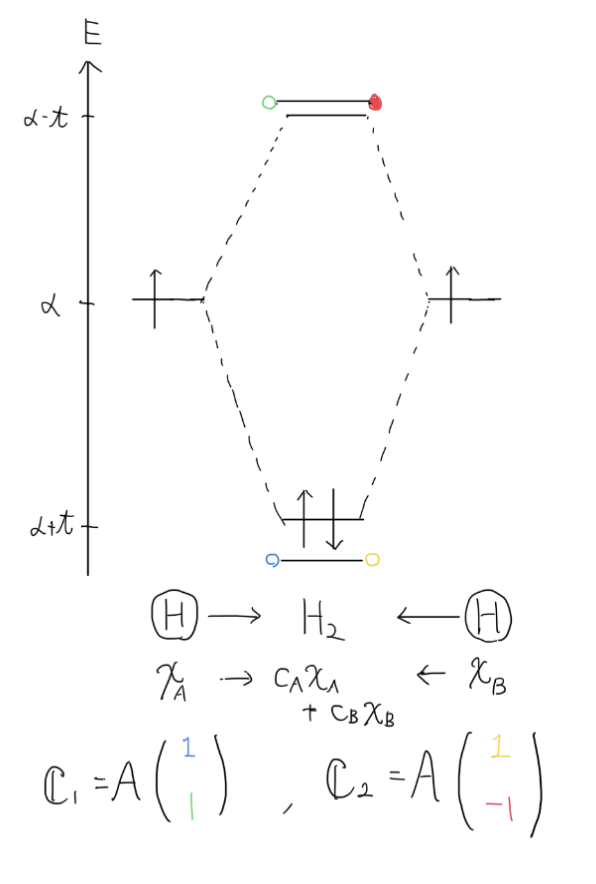

# 第一回 シュレディンガー方程式の変分法による解法

ハミルトニアン$\mathscr{H}$は古典的なエネルギー$E(\boldsymbol{r},\boldsymbol{p})$に対応原理を施したもの
:::note 対応原理
$$
\begin{align*}
    \boldsymbol{p} &\leftrightarrows -i\hbar\nabla \\
    E&\leftrightarrows -\frac{\hbar^2}{2m}\nabla^2
\end{align*}
$$
:::

## 目的

シュレディンガー方程式

$$
\begin{equation}
    \hat{H} \Psi=E\Psi
\end{equation}
$$

これを変分法で解く。
変分法を用いて 2 階偏微分方程式を連立斉次方程式にして解ける形にする。

## 発想

任意の関数$f$は、任意の関数系$\chi$を用いて、
$$
f=\sum_i C_i\chi_i
$$

と展開できることを用いて、シュレディンガー方程式の解である波動関数$\Psi$を

$$
\Psi=\sum_i C_i\chi_i
$$

と展開する。

:::note Ref
ノリは Fourier 級数展開と同じ

$$
f(x)=\sum_q F_qe^{iqx}
$$

:::

## 解法

これをシュレディンガー方程式に代入して

$$
\sum_iC_i\hat{H}\chi_i=E\sum_iC_i\chi_i
$$

両辺に左から$\chi_j~*$をかけて全空間積分をすると

$$
\int\chi_j^*\sum_iC_i\hat{H}\chi_id\boldsymbol{r}=E\int\chi_j^*\sum_iC_i\chi_id\boldsymbol{r}
$$

積分と$\sum$を入れ替えて、整理すると以下のようになる

$$
\sum_iC_i\int\chi_j^*\hat{H}\chi_id\boldsymbol{r}=E\sum_iC_i\int\chi_j^*\chi_id\boldsymbol{r}
$$

ここで両辺の積分部分を

$$
\begin{align}
    S_{ji}&=\int\chi_j^*\chi_id\boldsymbol{r}\\
    H_{ji}&=\int\chi_j^*\hat{H}\chi_id\boldsymbol{r}
\end{align}
$$

とおく。さらに重なり積分と呼ばれる$S_{ji}$について*Hückel*近似を用いて

$$
S_{ji}=\delta_{ji}
$$

とする。

:::note Hückel 近似
$S_{ji}$ : 重なり積分は波の重ね合わせ、$j$番目の波と$i$番目の波の重なり具合を表している。少しでもずれていると、その重なりは 0 であると、捉えても良い。という近似
:::

これより、シュレディンガー方程式は

$$
\sum_iC_iH_{ji}=E\sum_iC_i\delta_{ji}
$$

これを$j=1,2,3...$の時で並べて書いてみると

$$
\begin{align*}
    C_1H_{11}+C_2H_{12}+C_3H_{13}+\cdots&=EC_1\\
    C_1H_{21}+C_2H_{22}+C_3H_{23}+\cdots&=EC_2\\
    C_1H_{31}+C_2H_{32}+C_3H_{33}+\cdots&=EC_3\\
\end{align*}
$$

これを敷衍していくと

$$
\mathbb{C}=
\begin{pmatrix}
c_1 \\
c_2 \\
c_3 \\
\vdots
\end{pmatrix}
\,,\,
\mathbb{H'}=
\begin{pmatrix}
H_{11}-E & H_{12}   & H_{13} & \cdots\\
H_{21}   & H_{22}-E & H_{23} & \cdots\\
H_{31}   & H_{32}   & \ddots &  \vdots\\
\vdots   & \cdots   & \cdots
\end{pmatrix}
$$

とおけば

$$
\mathbb{CH'}=\mathbb{0}
$$

となり、$\mathbb{C}$を固有ベクトル, $E$を固有値とする固有値問題に帰着される。

:::note

$$
\mathbb{H}=
\begin{pmatrix}
H_{11} & H_{12}   & H_{13} & \cdots\\
H_{21}   & H_{22} & H_{23} & \cdots\\
H_{31}   & H_{32}   & \ddots &  \vdots\\
\vdots   & \cdots   & \cdots
\end{pmatrix}
$$

とおいた時に

$$
\mathbb{CH}=E\mathbb{H}
$$

このように見た方が、固有値と固有ベクトルの関係がわかりやすい
:::

$\mathbb{C}$の非自明解(物理的意味を持つ解)の条件は

$$
\det(\mathbb{H}-E\mathbb{I})= \det\mathbb{H'}=0
$$

これは数値計算によって解ける状態になった。
$\mathbb{C}$を元に$\Psi$を求め、それに対応するエネルギーが$E$となる。

# 第二回 変分原理の証明

## 目的 : 変分原理の証明

## 演算子の期待値

任意の関数$\Phi(\mathbb{r})$と、任意の演算子$\hat{A}$について、演算子の期待値$\langle{}\hat{A}\rangle{}$を以下のように**定義**する

$$
\langle{}\hat{A}\rangle{}\coloneqq\frac{\int\Phi^*\hat{A}\Phi d\mathbb{r}}{\int\Phi^*\Phi d\mathbb{r}}
$$

この定義から、エネルギーに対応する演算子は$\hat{H}$であるため、エネルギーの期待値$\langle{}\varepsilon\rangle{}$は

$$
\langle{}\varepsilon[\Phi]\rangle{}=\frac{\int\Phi^*\hat{H}\Phi d\mathbb{r}}{\int\Phi^*\Phi d\mathbb{r}}
$$

となる

## 変分原理

変分原理とは以下のような**定理**

$$
\langle{}\varepsilon[\Phi]\rangle{}\geq E_1
$$

任意の関数系$\Phi$で求められたエネルギーの期待値は、基底状態のエネルギー(エネルギー固有値の最小のもの)より大きい

### 変分原理の証明

#### Point : 波動関数で展開する

波動関数$\Psi$の完全規格直交性より任意の関数$\Phi$は以下のように展開できる

$$
\Phi=\sum_kC_k\Psi_k
$$

よって$\langle{}\varepsilon[\Phi]\rangle{}$は

$$
\langle{}\varepsilon[\Phi]\rangle{}=\frac{\int\Phi^*\hat{H}\Phi d\mathbb{r}}{\int\Phi^*\Phi d\mathbb{r}}
$$

$$
\begin{align*}
    (分母)=\int\Phi^*\Phi d\mathbb{r}
    &=\int(\sum_kC_k\Psi_k)^*(\sum_lC_l\Psi_l)d\mathbb{r}\\
    &=\sum_k\sum_lC_k^*C_l\delta_{kl}\\
    &=\sum_kC_k^*C_k = \sum_k|C_k|^2\\
\end{align*}
$$

(ただし、分母の計算の際には Hückel 近似を用いた)

$$
\begin{align*}
    (分子)=\int\Phi^*\Phi d\mathbb{r}
    &=\int(\sum_kC_k\Psi_k)^*\hat{H}(\sum_lC_l\Psi_l)d\mathbb{r}\\
    &=\sum_k\sum_lC_k^*C_l\int\Psi_k^*\hat{H}\Psi_ld\mathbb{r}\\
\end{align*}
$$

ここで、$\Psi$は波動関数であり、シュレディンガー方程式を満たすため、$\hat{H}\Psi=E\Psi$が成り立つ。

$$
\begin{align*}
    (分子)&=\sum_k\sum_lC_k^*C_lE_l\int\Psi_k^*\Psi_ld\mathbb{r}\\
    &=\sum_k\sum_lC_k^*C_lE_l\delta_{kl}\\
    &=\sum_k|C_k|^2E_k
\end{align*}
$$

ここで、シュレディンガー方程式から求められたエネルギー$E_1, E_2, E_3\cdots$に対して$E_1\leq E_2\leq E_3\leq \cdots$と定めておくと

$$
\langle{}\varepsilon[\Phi]\rangle{}=\frac{\sum_k|C_k|^2E_k}{\sum_k|C_k|^2}\geq \frac{\sum_k|C_k|^2E_1}{\sum_k|C_k|^2}=E_1
$$

等号成立は$E_1=E_2=E_3=\cdots$であることと、$\Phi=\Psi _1$であること。
ここで、$\Psi_1$は基底状態のエネルギー$E_1$に対応する波動関数

# 第三回 変分原理の利用 変分法

(再掲)
変分原理とは以下のような定理

$$
\langle{}\varepsilon[\Phi]\rangle{}\geq E_1
$$
任意の関数として設定する関数$\Psi$がたとえば波動関数$\Psi$ならば

$$
\langle{}\varepsilon[\Phi]\rangle{}=\frac{\int\Phi^*\hat{H}\Phi d\mathbb{r}}{\int\Phi^*\Phi d\mathbb{r}}=\frac{\int\Psi^*\hat{H}\Psi d\mathbb{r}}{\int\Psi^*\Psi d\mathbb{r}}=E
$$

となる。が、波動関数がわかっていない時には
パラメータである$\Phi$を変えながら、$\langle{}\varepsilon[\Phi]\rangle{}$の極小値を求めればいい。
:::note
実際は$\langle{}\varepsilon[\Phi]\rangle{}$の解は変数の数だけ(今回は$C_1$~$C_N$のN個)でてくるが、その中でも最小のエネルギー$\varepsilon_1$に対応する$\Phi$がもっとも$\Psi_1$に近い、という戦法
:::

$$
\langle{}\varepsilon[\Phi]\rangle{}(C_1,C_2,\cdots )
$$

この最小値を求めるには

$$
\frac{\partial \varepsilon}{\partial C_1}=\frac{\partial \varepsilon}{\partial C_2}=\frac{\partial \varepsilon}{\partial C_3}=\dots=0
$$

となるような$(C_1,C_2, C_3,\cdots)$を決定すればいい。実際には$N$個の変数($C_1$~$C_N$)を用いて、近似的に求める。
より一般に$\frac{\partial \varepsilon}{\partial c_i^*}$について考える。

$$
\Phi=\sum_i^NC_i\chi_i
$$
この時の$\Phi$は試行関数と呼ばれる。
:::tip
**有限**であることが大事
:::

これを用いて、*Hückel*近似を使わずに$\langle{}\varepsilon[\Phi]\rangle{}$を表すと以下のようになる。

:::caution
注意すべき点は今の仮定では$\Phi=\Psi$とは限らないため、変分原理の証明の際のような変形($\hat{H}\Psi=E\Psi$を使う変形)はできないこと。
(また実際には今は任意の関数系$\chi$で展開しているため、*Hückel*近似が使えるかはわからない)
:::

$$
\begin{equation}
\langle{}\varepsilon[\Phi]\rangle{}=\frac{\sum_i^N\sum_j^NC_i^*H_{ij}C_j}{\sum_i^N\sum_j^NC_i^*S_{ij}C_j}
\end{equation}
$$

と与えられるため

$$
\frac{\partial \varepsilon}{\partial c_i^*}=\frac{(\sum_j^NH_{ij}C_j)(\sum_i^N\sum_j^NC_i^*S_{ij}C_j)-(\sum_i^N\sum_j^NC_i^*H_{ij}C_j)(\sum_j^NS_{ij}C_j)}{(\sum_i^N\sum_j^NC_i^*S_{ij}C_j)^2}=0
$$

これは

$$
(\sum_j^NH_{ij}C_j)(\sum_i^N\sum_j^NC_i^*S_{ij}C_j)-(\sum_i^N\sum_j^NC_i^*H_{ij}C_j)(\sum_j^NS_{ij}C_j)=0
$$

となり、さらに(4)式を使って

$$
(\sum_j^NH_{ij}C_j)(\sum_i^N\sum_j^NC_i^*S_{ij}C_j)-\langle{}\varepsilon[\Phi]\rangle{}(\sum_i^N\sum_j^NC_i^*S_{ij}C_j)(\sum_j^NS_{ij}C_j)=0
$$

$$
(\sum_j^NH_{ij}C_j)-\langle{}\varepsilon[\Phi]\rangle{}(\sum_j^NS_{ij}C_j)=0
$$

これは以下のように書ける。

$$
\sum_j^N(H_{ij}-\langle{}\varepsilon[\Phi]\rangle{}S_{ij})C_j=0
$$

$i=1,2,3$について、それぞれ並べて書いてみる

$$
\begin{align*}
    C_1(H_{11}-\varepsilon S_{11})+C_2(H_{12}-\varepsilon S_{12})+C_3(H_{13}-\varepsilon S_{13})+\cdots&=0\\
    C_1(H_{21}-\varepsilon S_{21})+C_2(H_{22}-\varepsilon S_{22})+C_3(H_{23}-\varepsilon S_{23})+\cdots&=0\\
    C_1(H_{31}-\varepsilon S_{31})+C_2(H_{32}-\varepsilon S_{32})+C_3(H_{33}-\varepsilon S_{33})+\cdots&=0\\
\end{align*}
$$

これを敷衍すると

$$
\mathbb{C}=
\begin{pmatrix}
c_1 \\
c_2 \\
c_3 \\
\vdots\\
c_N
\end{pmatrix}
\,,\,
\mathbb{H'}=
\begin{pmatrix}
H_{11}-\varepsilon S_{11} & H_{12}-\varepsilon S_{12}   & H_{13}-\varepsilon S_{13} & \cdots & H_{1N}-\varepsilon S_{1N} \\
H_{21}-\varepsilon S_{21}   & H_{22}-\varepsilon S_{22} & H_{23}-\varepsilon S_{23} & \cdots & H_{2N}-\varepsilon S_{2N}\\
H_{31}-\varepsilon S_{31}   & H_{32}-\varepsilon S_{32}   & H_{33}-\varepsilon S_{33} &  \cdots & H_{3N}-\varepsilon S_{3N}\\
\vdots   & \cdots   & \cdots & \ddots  &\vdots \\
H_{N1}-\varepsilon S_{N1}   & H_{N2}-\varepsilon S_{N2}   & H_{N3}-\varepsilon S_{N3} &  \cdots & H_{NN}-\varepsilon S_{NN}\\
\end{pmatrix}
$$

$$
\mathbb{CH'}=\mathbb{0}
$$

これは**エネルギー期待値が極小値を持つ条件**である。$\mathbb{C}$が非自明な解を持つ条件は$det(\mathbb{H'})=0$これから$\varepsilon$は$N$個出てくる。基本的には$\varepsilon_1$に対応する試行関数$\Phi_1$が真の波動関数$\Psi_1$に一番近いものとして扱うが、実際は$\varepsilon_2,\varepsilon_3$くらいまでは真の波動関数に近似できるくらい近いこともある。
$\chi$がシュレディンガー方程式を満たす波動関数ならば*Hückel*近似を用いれば以下のように$\mathbb{H'}$はやや簡便になる

$$
\mathbb{H'}=
\begin{pmatrix}
H_{11}-\varepsilon & H_{12}   & H_{13} & \cdots & H_{1N} \\
H_{21}   & H_{22}-\varepsilon & H_{23} & \cdots & H_{2N}\\
H_{31}   & H_{32}   & H_{33}-\varepsilon &  \cdots & H_{3N}\\
\vdots   & \cdots   & \cdots & \ddots  &\vdots \\
H_{N1}   & H_{N2}   & H_{N3} &  \cdots & H_{NN}-\varepsilon\\
\end{pmatrix}
$$

## 物理的実態との結びつけ

2 原子分子$AB$について考える
原子 A は$\chi_A$, 原子 B は$\chi_B$という固有の原子軌道を持っている(ex 1s, 2s 軌道)時、AB が分子になった時に新たにできる分子軌道$\Psi$は

$$
\Psi=C_A\chi_A+C_B\chi_B
$$

と表せる。(**LCAO 近似**)

この時 A, B はそれぞれ 1 つずつしか軌道を持っていない($A$が$\chi_A$という軌道のみしか持っていない)とすると

$$
\begin{pmatrix}
H_{11}-\varepsilon & H_{12}\\
H_{21}   & H_{22}-\varepsilon\\
\end{pmatrix}\begin{pmatrix}
C_A\\
C_B\\
\end{pmatrix}=0
$$

ここで、仮定として

$$
H_{ij}=\left\{
\begin{align*}
   \quad &\alpha　&(i=j)\\
   \quad &t &(i\neq j)
\end{align*}
\right.
$$

$\alpha$: on-site energy 原子自体が持つエネルギー, $t$: transfer energy 2 原子間の相互作用エネルギー
とすれば$det(\mathbb{H'})$を解くと $\varepsilon=\alpha\pm t$となる。対応する固有ベクトルは
(この仮定は同原子の 2 原子分子の時に有効、$H_2$など)

$$
\mathbb{C_1}=A\begin{pmatrix}
    1\\
    1
\end{pmatrix}
\,\,\,
,
\mathbb{C_2}=A\begin{pmatrix}
    1\\
    -1
\end{pmatrix}
$$

規格化を行えば$A=\frac{1}{\sqrt{2}}$とわかる。

## エネルギー固有値と固有ベクトルの物理的実態

水素分子について考えると
エネルギー固有値の$\varepsilon=\alpha\pm t$はそれぞれ、結合性軌道と反結合性軌道のエネルギーを表している。

中黒は位相が反転していることを表している。  
そしてそれぞれの固有ベクトルの成分が、それぞれの軌道の混ざり具合を表しているとわかる。

# 集中講義まとめ(第 1~3 回)

## 一番の動機：シュレディンガー方程式の解が知りたい

$$
\hat{H}\Psi=E\Psi
$$

未知数は$\Psi$と$E$(実際には複数の$(\Psi,E)$組が解となる)
解法としては変分法(Litz の変分法)を用いた

$$
\mathbb{H'C}=0
$$

これを満たす$\mathbb{C}$と$E$を求める問題に帰着した。before 変分法と after 変分法で、以下のような関係がある。

$$
\Psi=\sum_iC_i\chi_i \,\, , \,  H_{ij}=\int\chi_i^*\hat{H}\chi_jd\boldsymbol{r}
$$

(ただし、$\chi$は任意の関数系を選択する)

これでシュレディンガー方程式を解くことまではできた。が、$\hat{H}$が単純な形で描かれることは稀である。たとえば 2 原子、3 原子分子の全体の波動関数を求めようとすると、$\hat{H}$が簡単な形にならず、$\Psi$を解くこと自体が難しい。
1 つの原子の波動関数は簡単だが、多原子になると難しいという問題が生じる

## 次の動機：多原子分子の波動関数を求めたい

### 発想

LCAO 近似を用いる。(Linear-combination-of-atomic-orbitals 法)

#### LCAO 近似

全体の波動関数は部分の波動関数の線形結合で表せると仮定する近似

$$
\Psi=C_A\Psi_A+C_B\Psi_B
$$

これを用いると、多原子分子の波動関数を知りたい時に、それを構成する単原子の波動関数の線型結合で求めることができるようになる。その上、$\mathbb{H'}$ および$\mathbb{C}$も有限次元の行列となるため、計算が容易

$$
\mathbb{CH'}=\mathbb{0}
$$

またそれぞれの固有ベクトル$\mathbb{C}$の成分が、部分の波動関数の構成比になることがわかった。

$\mathbb{C}$の数分だけ、結合軌道と半結合軌道が生まれる。というとこまでわかった。

次回以降はどことどこの軌道が混成軌道を作るのかを決定できるようになる...らしい。(群論の知識が必要)
群論の既約表現は偶関数、奇関数を拡張したもの

---

## 例題
一次元系で無限の井戸型ポテンシャルの中にいる電子の波動関数を変分法で求める。
$$
    \mathscr{H}=\left\{ 
        \begin{align*}
            &\frac{|\boldsymbol{p}|^2}{2m} \space &(|x|<\frac{L}{2})\\
            &\infty \space &(\frac{L}{2}<|x|)
        \end{align*}
        \right.
$$
### まず直接解いてみる
井戸の中におけるシュレディンガー方程式は以下のようになる。
$$
\begin{equation}
    -\frac{\hbar^2}{2m}\frac{\partial^2}{\partial x^2}\Psi=E\Psi
\end{equation}
$$
これはただの二階常微分方程式であるため、特殊解を$\Psi_0=e^{ikx}$とおけば
$$
\frac{\hbar^2}{2m}k^2=E \,\,\,\, \therefore k=\pm \sqrt{\frac{2mE}{\hbar^2}}
$$
よって一般解は特殊解の線型結合であるため
$$
\Psi=C_1e^{i\sqrt{\frac{2mE}{\hbar^2}}x}+C_2e^{-i\sqrt{\frac{2mE}{\hbar^2}}x}
$$
これはさらにオイラーの公式を使えば
$$
\Psi=C_1(\cos kx+i\sin kx)+C_2(\cos kx-i\sin kx)=(C_1+C_2)\cos kx+(C_1-C_2)i\sin kx
$$
これは適切に定数を置き直せば
$$
\Psi=A\cos\left( \sqrt{\frac{2mE}{\hbar^2}}x\right)+B\sin\left( \sqrt{\frac{2mE}{\hbar^2}}x\right)
$$

となる。
境界条件とは
$$
\begin{align}
    \Psi(\pm\frac{L}{2})=0
\end{align}
$$


$$
\Psi(\pm\frac{L}{2})=A\cos\left( \sqrt{\frac{2mE}{\hbar^2}}\frac{L}{2}\right)\pm B\sin\left( \sqrt{\frac{2mE}{\hbar^2}}\frac{L}{2}\right)=0
$$
これら二つを足し合わせたものと、引き算したものから
$$
\begin{align*}
    A\cos\left( \sqrt{\frac{2mE}{\hbar^2}}\frac{L}{2}\right)&=0 &\therefore & \,\,\,A=0 \,\,or\,\,  \sqrt{\frac{2mE}{\hbar^2}}\frac{L}{2} =\frac{2n-1}{2}\pi\\
    B\sin\left( \sqrt{\frac{2mE}{\hbar^2}}\frac{L}{2}\right)&=0 &\therefore &\,\,\,B=0 \,\,or\,\,  \sqrt{\frac{2mE}{\hbar^2}}\frac{L}{2} =n\pi
\end{align*}
$$
$A,B$が同時に0になってしまうと、$\Psi$が物理的意味を持たないため、境界条件からは以下の二つの条件が得られる

$$
\begin{equation}
    \left\{
        \begin{align*}
            A&=0\\
            \sqrt{\frac{2mE}{\hbar^2}}\frac{L}{2} &=n\pi
        \end{align*}    
    \right.
\end{equation}
\,\,\,\,\,\,\,\,\,\,\,\,\,\,\,\,\,\,\,\,\,\,\,\,\,\,\,\,\,\,\,\,\,\,\,\,\,\,\,\,\,\,\,\,\,\,\,\,\,\,\,\,\,\,\,\,
\begin{equation}
     \left\{
        \begin{align*}
            B&=0\\
            \sqrt{\frac{2mE}{\hbar^2}}\frac{L}{2} &=\frac{2n-1}{2}\pi
        \end{align*}    
    \right.
\end{equation}
$$

よって波動関数$\Psi$は
$$
\begin{equation}
   \Psi=B\sin\frac{2n\pi}{L}x
\end{equation}
\,\,\,\,\,\,\,\,\,\,\,\,\,\,\,\,\,\,\,\,\,\,\,\,\,\,\,\,\,\,\,\,\,\,\,\,\,\,\,\,\,\,\,\,\,\,\,\,\,\,\,\,\,\,\,\,
\begin{equation}
    \Psi=A\cos\frac{(2n-1)\pi}{L}x 
\end{equation}
$$

なお、$A,B$は*Born*の解釈によって求められる。これは$\Psi$が電子の存在確率を表している。という解釈のもとに設定される
$$
\begin{equation}
\int |\Psi|^2d\boldsymbol{r}=\int \Psi\Psi^*d\boldsymbol{r}=1    
\end{equation}
$$
(全空間で積分すると、必ずどこかに電子はいるから1)


$$
\int_{-\frac{L}{2}}^{\frac{L}{2}} A^2\cos^2\left(\frac{2n\pi}{L}x \right)d\boldsymbol{r}
=1
$$
これは計算すると
$$
\begin{align*}
    \int_{-\frac{L}{2}}^{\frac{L}{2}} A^2\cos^2\left(\frac{2n\pi}{L}x \right)d\boldsymbol{r}
    &=A^2\int_0^{\frac{L}{2}}1+\cos\left(\frac{2n\pi}{L}x \right)d\boldsymbol{r}\\
    &=\frac{L}{2}A^2\\
    \therefore A&=\pm\sqrt{\frac{2} {L}}
\end{align*}
$$
同様に$B=\pm\sqrt{\frac{2} {L}}$も直ちにもとまる。

また、境界条件より、エネルギー$E$の条件も合わせると、波動関数は

$$
\begin{equation}
    \left\{
        \begin{align*}
            \Psi&=\pm\sqrt{\frac{2} {L}}\sin\frac{2n\pi}{L}x \\
            E&=\frac{\hbar^2}{2m}\left(\frac{2n\pi}{L}\right)^2
        \end{align*}    
    \right.
\end{equation}
\,\,\,\,\,\,\,\,\,\,\,\,\,\,\,\,\,\,\,\,\,\,\,\,\,\,\,\,\,\,\,\,\,\,\,\,\,\,\,\,\,\,\,\,\,\,\,\,\,\,\,\,\,\,\,\,
\begin{equation}
     \left\{
        \begin{align*}
           \Psi&=\pm\sqrt{\frac{2} {L}}\cos\frac{(2n-1)\pi}{L}x \\
            E&=\frac{\hbar^2}{2m}\left(\frac{(2n-1)\pi}{L}\right)^2
        \end{align*}    
    \right.
\end{equation}
$$
ここで、$n \in \Z$であるため、エネルギーが飛び飛びの正の値しか取り得ないこともわかる。基底状態に対応する波動関数$\Psi_1$は
$$
\begin{align}
           \Psi_1&=\pm\sqrt{\frac{2} {L}}\cos\frac{\pi}{L}x \\
            E_1&=\frac{\hbar^2}{2m}\left(\frac{\pi}{L}\right)^2=\frac{h^2}{8m}\left(\frac{1}{L}\right)^2
\end{align} 
$$

:::question
$A,B$は正の値って限定はないの??
:::

### 次にこれを変分法で解く

変分法は以下の原理を使うアプローチ
$$
\langle{}\varepsilon[\Phi]\rangle{}\geq E_1
$$
ただし$E_1$は基底状態のエネルギー
たとえば今、関数系$\Phi$を以下のように設定する

$$
\Phi=C_1(x-\frac{L}{2})(x+\frac{L}{2})+C_2x(x-\frac{L}{2})(x+\frac{L}{2})
$$
これはいうまでもなく、境界条件を満たしている。
:::tip POINT
変分法で設定する関数系は**有限の直行系**であることがほとんど。故に基底状態のエネルギーに一致することはほとんどない。
無限の完全直行系で展開すれば一致する。
:::

エネルギー期待値のの定義から計算を行うと
$$
\langle{}\varepsilon[\Phi]\rangle{}=\frac{\int_{-\frac{L}{2}}^{\frac{L}{2}}\Phi^*\mathscr{H}\Phi d\boldsymbol{r}}{\int_{-\frac{L}{2}}^{\frac{L}{2}}\Phi^*\Phi d\boldsymbol{r}}
$$

$(奇関数)\times(偶関数)=(奇関数)$という性質を用いて

$$
\begin{align*}
    (分母)
    &=2\int_0^{\frac{L}{2}}\left(C_2x(x-\frac{L}{2})(x+\frac{L}{2})\right)^2+\left(C_1(x-\frac{L}{2})(x+\frac{L}{2})\right)^2dx\\
    &=\int_{-\frac{L}{2}}^{\frac{L}{2}}(C_1^2+C_2^2x^2)(x-\frac{L}{2})^2(x+\frac{L}{2})^2dx\\
    &=C_1^2 \frac{L^5}{30}+C_2^2\int_{-\frac{L}{2}}^{\frac{L}{2}}x^2(x-\frac{L}{2})^2(x+\frac{L}{2})^2dx\\
     &=C_1^2 \frac{L^5}{30}+2C_2^2\int_0^{\frac{L}{2}}x^6-\frac{L^2}{4}x^4+\frac{L^4}{16}x^2dx\\
      &=C_1^2 \frac{L^5}{30}+2C_2^2\left[\frac{1}{7}x^7-\frac{L^2}{20}x^5+\frac{L^4}{48}x^3\right]_0^{\frac{L}{2}}\\
    &=C_1^2 \frac{L^5}{30}+2C_2^2\left(\frac{1}{7}(\frac{L}{2})^7-\frac{L^2}{20}(\frac{L}{2})^5+\frac{L^4}{48}(\frac{L}{2})^3\right)\\
    &=C_1^2 \frac{L^5}{30}+2C_2^2(\frac{L}{2})^7\left(\frac{1}{7}-\frac{1}{5}+\frac{1}{3}\right)\\
    &=C_1^2 \frac{L^5}{30}+\frac{2}{105}C_2^2(\frac{L}{2})^7
\end{align*}
$$

また分子について
$$
\begin{align*}
    (分子)
    &=\int_{-\frac{L}{2}}^{\frac{L}{2}}\Phi^*(-\frac{\hbar^2}{2m})\frac{\partial^2}{\partial x^2}\left(C_1(x-\frac{L}{2})(x+\frac{L}{2})+C_2x(x-\frac{L}{2})(x+\frac{L}{2})\right) dx\\
    &=-\frac{\hbar^2}{2m}\int_{-\frac{L}{2}}^{\frac{L}{2}}\left(C_1(x-\frac{L}{2})(x+\frac{L}{2})+C_2x(x-\frac{L}{2})(x+\frac{L}{2})\right)\left(2C_1+6C_2x\right) dx\\
    &=-2\frac{\hbar^2}{2m}\int_0^{\frac{L}{2}}\left(2C_1^2(x-\frac{L}{2})(x+\frac{L}{2})+6C_2^2x^2(x-\frac{L}{2})(x+\frac{L}{2})\right)dx\\
    &=-\frac{\hbar^2}{m}\int_0^{\frac{L}{2}}\left(2C_1^2(x-\frac{L}{2})(x+\frac{L}{2})+6C_2^2x^2(x-\frac{L}{2})(x+\frac{L}{2})\right)dx\\
    &=-\frac{\hbar^2}{m}\left(-\frac{L^3}{6}C_1^2+6C_2^2\int_0^{\frac{L}{2}}\left(x^2(x-\frac{L}{2})(x+\frac{L}{2})\right)dx\right)\\
    &=\frac{\hbar^2}{m}\frac{L^3}{6}C_1^2-\frac{\hbar^2}{m}6C_2^2\int_0^{\frac{L}{2}}x^2(x-\frac{L}{2})(x+\frac{L}{2})dx\\
    &=\frac{\hbar^2}{m}\frac{L^3}{6}C_1^2-\frac{\hbar^2}{m}6C_2^2\int_0^{\frac{L}{2}}(x^4-\frac{L^2}{4}x^2)dx\\
    &=\frac{\hbar^2}{m}\frac{L^3}{6}C_1^2-\frac{\hbar^2}{m}6C_2^2
    \left[\frac{1}{5}x^5-\frac{L^2}{12}x^3\right]_0^{\frac{L}{2}}\\
    &=\frac{\hbar^2}{m}\frac{L^3}{6}C_1^2-\frac{\hbar^2}{m}6C_2^2
    (\frac{1}{160}-\frac{1}{96})L^5\\
    &=\frac{\hbar^2}{m}(\frac{C_1^2}{6}+\frac{C_2^2L^2}{40})L^3
\end{align*}
$$
よってエネルギー期待値は
$$
\langle{}\varepsilon[\Phi]\rangle{}=\frac{\frac{\hbar^2}{m}(\frac{C_1^2}{3}+\frac{C_2^2L^2}{20})}{ \frac{L^2}{15}C_1^2+\frac{4}{105}C_2^2(\frac{1}{2})^7L^4}
$$
これの極小値を求める。$C_1,C_2$それぞれで偏微分をとって
$$
\begin{align*}
    \frac{\partial}{\partial C_1}\langle{}\varepsilon[\Phi]\rangle{}&=
\frac{
    \frac{\hbar^2}{m}
    \frac{2C_1}{3}\left(\frac{L^2}{15}C_1^2+\frac{4}{105}C_2^2(\frac{1}{2})^7L^4\right)-\frac{\hbar^2}{m}(\frac{C_1^2}{3}+\frac{C_2^2L^2}{20})\frac{2L^2C_1}{15}}
    { \left(\frac{L^2}{15}C_1^2+\frac{4}{105}C_2^2(\frac{1}{2})^7L^4\right)^2}=0\\
    \therefore C_2&=0\\
    \frac{\partial}{\partial C_2}\langle{}\varepsilon[\Phi]\rangle{}&=
\frac{
    \frac{\hbar^2}{m}
    \frac{C_2L^2}{10}\left(\frac{L^2}{15}C_1^2+\frac{4}{105}C_2^2(\frac{1}{2})^7L^4\right)-\frac{\hbar^2}{m}(\frac{C_1^2}{3}+\frac{C_2^2L^2}{20})\frac{1}{105}C_2^2(\frac{1}{2})^4L^4}
    { \left(\frac{L^2}{15}C_1^2+\frac{4}{105}C_2^2(\frac{1}{2})^7L^4\right)^2}=0\\
    \therefore C_1&=0
\end{align*}
$$


よって、この時のエネルギー期待値はそれぞれ

$$
\begin{equation}
    \langle{}\varepsilon[\Phi]\rangle{}=\frac{5\hbar^2}{mL^2}
\end{equation}
\,\,\,\,\,\,\,\,\,\,\,\,\,\,\,\,\,\,\,\,\,\,\,\,\,\,\,\,\,\,\,\,\,\,\,\,\,\,\,\,\,\,\,\,\,\,\,\,\,\,\,\,\,\,\,\,
\begin{equation}
    \langle{}\varepsilon[\Phi]\rangle{}=\frac{168\hbar^2}{ mL^2}
\end{equation}
$$
となる。よって、最小のエネルギーは$E=\frac{5\hbar^2}{mL^2}$で、これに対応する試行関数は
$$
\begin{equation}
    \Phi=C_1(x-\frac{L}{2})(x+\frac{L}{2})
\end{equation}
$$
規格化条件を求めると
$$
\begin{align*}
    \int_{-\frac{L}{2}}^{\frac{L}{2}}C_1^2(x-\frac{L}{2})^2(x+\frac{L}{2})^2dx&=1\\
    C_1^2\frac{L^5}{30}&=1\\
    \therefore C_1 &=\pm\frac{1}{L^2}\sqrt{\frac{30}{L}}
\end{align*}
$$
よって

$$
\begin{align}
          \Phi_1&=\pm\frac{1}{L^2}\sqrt{\frac{30}{L}}(x-\frac{L}{2})(x+\frac{L}{2})\\
            E_1&=\frac{5\hbar^2}{mL^2}
\end{align} 
$$
これは真の解である波動関数と近しいものとなっている
$$
\begin{align}
           \Psi_1&=\pm\sqrt{\frac{2} {L}}\cos\frac{\pi}{L}x \\
            E_1&=\frac{\hbar^2}{2m}\left(\frac{\pi}{L}\right)^2=\frac{\pi^2h^2}{2mL^2}\approx\frac{4.9348\hbar^2}{mL^2}
\end{align} 
$$

```python {cmd=true matplotlib=true}
import numpy as np
import matplotlib.pyplot as plt

# パラメータの設定
L = 2  # Lの長さを設定（任意に変更可能）

# x軸の範囲を設定
x = np.linspace(-L/2, L/2, 1000)

# 厳密解Psi1の計算
Psi1_pos = np.sqrt(2 / L) * np.cos(np.pi / L * x)
Psi1_neg = -Psi1_pos

# 変分法による近似解Phi1の計算
Phi1_pos = np.sqrt(30 / L) * (1 / (L**2)) * (x - L/2) * (x + L/2)
Phi1_neg = -Phi1_pos

# プロット
plt.figure(figsize=(10, 6))
plt.plot(x, Psi1_pos, 'b', linewidth=1.5, label=r'$\Psi_1$ (positive)')
plt.plot(x, Psi1_neg, 'b--', linewidth=1.5, label=r'$\Psi_1$ (negative)')
plt.plot(x, Phi1_pos, 'r', linewidth=1.5, label=r'$\Phi_1$ (positive)')
plt.plot(x, Phi1_neg, 'r--', linewidth=1.5, label=r'$\Phi_1$ (negative)')

# グラフの設定
plt.xlabel('x')
plt.ylabel('y value')
plt.title('Exact solution and approximate solution of variational method')
plt.legend()
plt.grid(True)
plt.show()

```
グラフを見ても、かなり良い精度