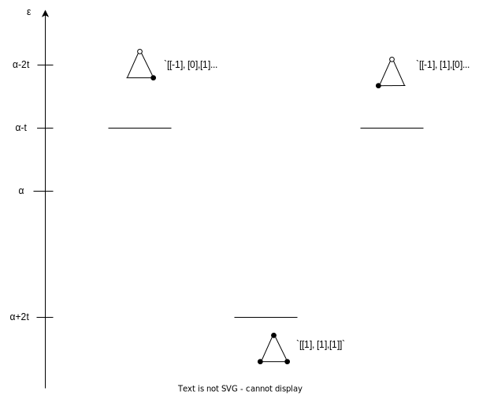

# Tight-Binding Model

### H$_3$Li$_36$角形のエネルギーバンド図

1Y22F152  
矢澤駿

  
    next page<carbon:arrow-down class="inline"/>
  

  <button @click="$slidev.nav.openInEditor()" title="Open in Editor" class="text-xl slidev-icon-btn opacity-50 !border-none !hover:text-white">
    <carbon:edit />
  </button>
  <a href="https://github.com/slidevjs/slidev" target="_blank" alt="GitHub" title="Open in GitHub"
    class="text-xl slidev-icon-btn opacity-50 !border-none !hover:text-white">
    <carbon-logo-github />
  </a>

---

# Tight-Binding Model(強結合近似モデル)
***

電子バンド計算の際に用いられる近似の一つで、系の波動関数を各原子の場所に位置する孤立原子に対する波動関数の重ね合わせにより近似する手法

要は分子の形に注目して、その分子のエネルギー準位を、それを構成する部分に分けて結合(混成)の様式を考える手法のことで、なぜそのエネルギーの位置にそのような波動関数のバンドが出るのかに解釈を与えるもの。

やがては全ての分子を1原子の軌道(基底)同士の結合(混成)に還元させることが目的。また、

## 混成の条件

1. **同じ規約表現にある波動関数が混成する**
2. **近しいエネルギーの波動関数が混成する**

今回の目的

H$_3$Li$_3$$6$角形分子のエネルギーの計算とそのバンド図がどこから起因するものなのかを調べる

---

# 計算理論
***

**LCAO近似** 
$n$原子分子の波動関数$\boldsymbol{\Psi}_n$はそれぞれ個々の原子軌道$\{\chi_i\}$で以下のように近似されるとする。
$$
\boldsymbol{\Psi}_n=
\begin{pmatrix}
  C_1 & C_2 & \cdots & C_n
\end{pmatrix}
\begin{pmatrix}
  \chi_1 \\
  \chi_2 \\
  \vdots \\
  \chi_n
\end{pmatrix}
$$

この波動関数の**未知定数**$\{C_i\}$と取りうる**エネルギー**を決定したい。

**変分法** 
変分法を用いると、この近似した波動関数を用いてエネルギー期待値の最小値を求める。
$$
\braket{\varepsilon}[\boldsymbol{\Psi}]=\frac{\int\boldsymbol{\Psi}^*\mathscr H\boldsymbol{\Psi}d\boldsymbol{r}}{\int\boldsymbol{\Psi}^*\boldsymbol{\Psi}d\boldsymbol{r}}
$$

---

# 計算理論(続き)
***

エネルギー期待値に最小値を与える条件がヒュッケル行列$\mathbb H$を用いて以下のように与えられる。
$$
\mathbb{H}\mathbb{C}=\varepsilon \mathbb{C}
$$

$$
\mathbb H=\begin{pmatrix}
  \alpha & t & 0 & \cdots & 0 & t \\
  t & \alpha & t & \cdots & 0 & 0  \\
  0 & t & \alpha & \cdots & 0 &  0\\
  \vdots & \vdots & \vdots & \ddots & \vdots & \vdots \\
  0 & 0 & 0 & \cdots & \alpha & t \\
  t & 0 & 0 & \cdots & t & \alpha \\
\end{pmatrix}
$$
ただしここで**最近接近似**を取り入れた。
これは**固有値**が$\varepsilon$**固有雨ベクトル**が$\mathbb C$となる固有値問題となる。

---

# 計算理論(続き)
***

今回は水素の結合長$0.7414\AA$を基準として正$6$角形を作る。
ハリソンの方法と、固体物性表の値よりon-site energyとtransfer energyは以下のようになる

|   | $\alpha$ | t |
|:-:| :------: |:-:|
| H(1s)  | -13.6 |d |
| Li(2s) | -5.48 |d |

$$

$$
---

# 簡約
***
どのような固有ベクトル(規約表現)が出てくるかは**点群**とそれのもとで決める**基底**によって**簡約する**こと決まる 

水素$6$角形$H_6$分子の場合、点群は$D_{6h}$、基底は$1s(\times6)$である。
よってこのもとで$1s$軌道を基底とした水素$6$角形分子を簡約する。
$$
\begin{align*}
  D_{6h}=D_6\times C_i
  &=\{E,2C_6,2C_3,C_2,3C_2',3C_2''\}\times\{E,i\}\\
  &=\{E,2C_6,2C_3,C_2,3C_2',3C_2'',i,2S_3,2S_6,\sigma_h,3\sigma_d,3\sigma_v\}
\end{align*}
$$
$\Gamma$は規約表現$A_i$がいくつ出てくるかを表していて、以下の式に従って求められる。
$$
\Gamma=\sum_iA_i=\sum_i\frac{1}{h}\sum\chi(R)\chi_i(R)
$$

---

| $D_{6h}$ | $E$ | $2C_6$ | $2C_3$ |$C_2$ | $3C_2'$ | $3C_2''$ | $i$ | $2S_3$ | $2S_6$ | $\sigma_h$ | $3\sigma_d$ | $3\sigma_v$|
| :-: | :-: | :-: | :-: | :-: | :-: | :-: | :-: | :-: | :-: | :-: | :-: | :-: |
| $\chi(R)$ | $6$ | $0$ | $0$ | $0$ | $2$ | $0$ | $0$ | $0$ | $0$ | $6$ | $2$ | $0$|

ヒュッケル行列は

---

## 規約表現を振るコツ

規約表現はその分子が属する「点群」と、「その点群の対称操作による位相の状態の変化」から与えられるもの。
ポイントは、
- **同じエネルギー固有値を持つ波動関数(の基底ベクトル)に対して振っていく**こと
- **基底ベクトルが直行性を満たしてない**と規約表現が触れない
  - (必要であれば、同じエネルギー固有値に対する固有ベクトルの線型結合はまた、同じエネルギーに対する固有ベクトルとなることを用いる)

また混成前の分子に規約表現を振る際、注意するべき点は
- 混成後の分子の形に対して、混成前の分子それぞれの位置関係が変わらないような対称操作を集めた点群の規約表現を振るとよいということ

---

# 正$3$角形分子の計算
***
$$
\mathbb{H}=\begin{pmatrix}
  \alpha & t & t \\
  t & \alpha & t \\
  t & t & \alpha \\
\end{pmatrix}
$$

これの固有値とそれに対応する固有ベクトルを解くと
$$
\varepsilon=\alpha- t,\alpha- t,\alpha+ 2t,\qquad 
\{\mathbb{C}\}
=\left\{\begin{pmatrix}
  -1\\0\\1
\end{pmatrix},
\begin{pmatrix}
  -1\\1\\0
\end{pmatrix},
\begin{pmatrix}
  1\\1\\1
\end{pmatrix}\right\}
$$

--- 

エネルギーバンド図は以下のようになる
</img>

このエネルギーバンドがどこから起因するものなのかを考えるのがtight-bindingの本懐

---

## 規約表現を振る

この三角形の分子が1つの直線分子と1つの単原子から混成してできたものとして考える。(実際はどのように混成させてもいい)
今回は混成前の分子(1つの直線分子と1つの単原子)は$C_{2v}$で規約表現を振る。

最終的には以下のようなバンド図が考えられる

</img>

結合-反結合を作らないバンドはそのまま出ることがわかる

---

# 正$6$角形の分子について計算してみる

  

ヒュッケル行列を直接解いて固有値固有ベクトルを求めてみる。最近接近似を用いればヒュッケル行列$\mathbb{H}$は以下のように書ける
$$
\mathbb{H}=\begin{pmatrix}
  \alpha & t & 0 & 0 & 0 & t \\
  t & \alpha & t & 0 & 0 & 0 \\
  0 & t & \alpha & t & 0 & 0 \\
  0 & 0 & t & \alpha & t & 0 \\
  0 & 0 & 0 & t & \alpha & t \\
  t & 0 & 0 & 0 & t & \alpha \\
\end{pmatrix}
$$

  

これの固有値とそれに対応する固有ベクトルは
$$
\varepsilon=\alpha-2t,\alpha-t,\alpha-t,\alpha+t,\alpha+t,\alpha+2t
$$
$$
\{\mathbb{C}\}
=\left\{
\begin{pmatrix}
  -1\\1\\-1\\1\\-1\\1
\end{pmatrix},
\begin{pmatrix}
  -1\\0\\1\\-1\\0\\1
\end{pmatrix},\begin{pmatrix}
  -1\\1\\0\\-1\\1\\0
\end{pmatrix},\begin{pmatrix}
  1\\0\\-1\\-1\\0\\1
\end{pmatrix},\begin{pmatrix}
  -1\\-1\\0\\1\\1\\0
\end{pmatrix},\begin{pmatrix}
  1\\1\\1\\1\\1\\1
\end{pmatrix}
\right\}
$$

---

これをエネルギー準位図に描画すると以下のようになる

</img>

---

## Tight-Binding Modelにしたがって考えてみる

せっかく三角形のバンド図を求めているから、正三角形($D_{3h}$)を構成分子として正六角形を考えてみる

三角形をずらして重ねた形が正六角形になると考えると、$D_{3h}$で規約表現を振れることがわかる

</img>

---

# 番外編 指標表の作り方

指標表は、点群に一対一対応している
## 例として$D_{7h}$の指標表を作る

### STEP1. 対称操作を列挙する

$$
D_{7h}=\{E,2C_7,2C_7^2,2C_7^3,7C_2,\sigma_h,2S_7,2S_7^3,2S_7^5,7\sigma_v\}
$$

あるいは$D_{7h}=D_7\times C_s$として得ても良い
$$
D_7=\{E,C_7,C_7^2,C_7^3,C_7^4,C_7^5,C_7^6,C_2,C_2',C_2'',C_2''',C_2^{iv},C_2^{v},C_2^{vi}\}
$$

あるいは要素数を数えて$N(D_7)=14,N(C_s)=2$より、$N(D_{7h})=28$と確認してもいい

**参考文献**
- [点群のまとめと座標表](https://www.iwanami.co.jp/files/moreinfo/0051900/PG.pdf)

---

## STEP2.

ここまで書いて、、、指標表を作るのは難しいみたいです。調べた方が早いらしいので諦め
キーワード：剰余類、部分群