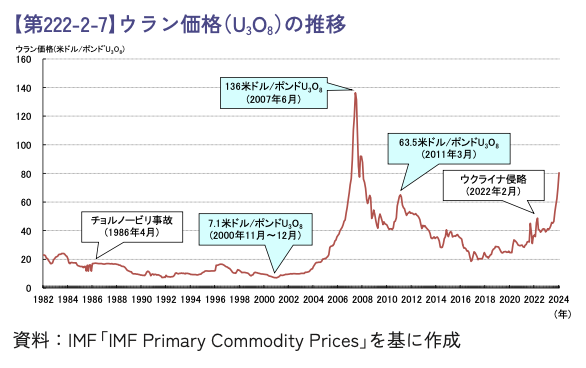
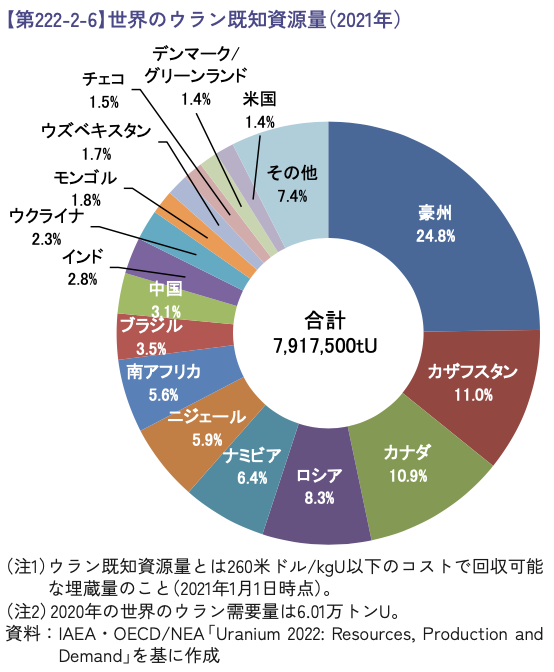
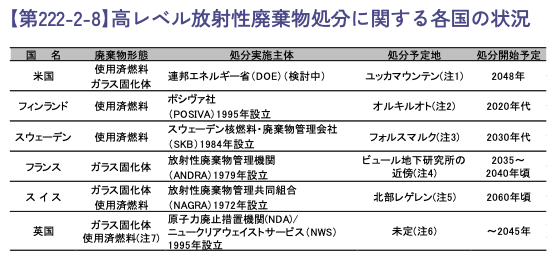
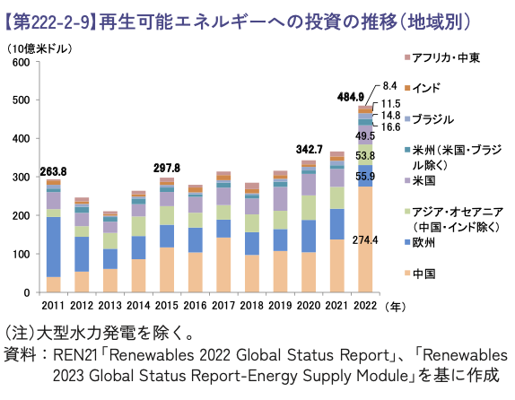
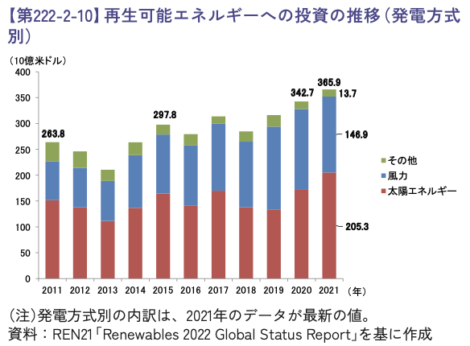

# エネルギー白書(R5)要約

### 国際エネルギーの動向と再生可能エネルギーの導入量

1Y22F152  
矢澤駿

  
    next page<carbon:arrow-down class="inline"/>
  

  <button @click="$slidev.nav.openInEditor()" title="Open in Editor" class="text-xl slidev-icon-btn opacity-50 !border-none !hover:text-white">
    <carbon:edit />
  </button>
  <a href="https://github.com/slidevjs/slidev" target="_blank" alt="GitHub" title="Open in GitHub"
    class="text-xl slidev-icon-btn opacity-50 !border-none !hover:text-white">
    <carbon-logo-github />
  </a>

---

<KeyboardAnimation :words="toc" :speed="80">
</KeyboardAnimation>

***

P142((イ)から)-151(第3節前まで)

0. 米国の原子力発電の現状
1. 原子力発電の現状
   1. 欧州　　:　イギリス、フランス、ドイツ、その他欧州
   2. アジア　:　中国、台湾、韓国、インド、ロシア
2. 核燃料サイクルの現状
   1. ウラン資源、ウラン濃縮、再処理、プルサマール
   2. 各国の高レベル放射性廃棄物の処分状況
      -  アメリカ、フィンランド、スウェーデン、フランス
3. 再生可能エネルギーについて
   1. 太陽、風、バイオ、水力、地熱
   2. コスト動向

---

# 1.1.1 原子力発電の現状---イギリス
***
**政策・方針・目標**
- 2007年以降、新設を推進。  
- 2030年までに最大8基の原子炉新設、2050年に原子力割合25%を目標。  
- FIT-CfD制度やRABモデルで事業リスクを軽減。  

**進展・進行中のプロジェクト**
- ヒンクリー・ポイントC (建設中)、サイズウェルC (計画中)。  
- 「Nuclear Sector Deal」で技術研究やAMRの開発を推進。

<!-- 
  FIT-CfD制度導入や5億ポンドの投資
  イギリスのエネルギー政策は、長期的なエネルギー安定供給を目指しており、原子力発電をその中心に据えています。2007年以降、新設の原子力発電所の推進を始め、2030年までに最大8基の新設、2050年までに電力需要の25%を原子力で賄うことを目標としています。特に、RAB（規制資産ベース）モデルの導入により、投資家のリスクを軽減し、安定的な投資を促進することが大きな特徴です。

これにより進行中のプロジェクトとしては、建設中のヒンクリー・ポイントCが挙げられます。この発電所は、最新のEPR型原子炉を採用し、2030年の稼働を目指しています。また、サイズウェルCも計画されており、RABモデルの試験的適用が予定されています。

### RABモデルとは何か
- 設備投資に見合った適切なリターンを規制機関が評価し、その費用を消費者料金から回収する仕組み。  
- 投資リスクを軽減し、最終的に消費者の負担を軽減すると期待されている。  
- 例: 英国のサイズウェルC発電所で導入予定。

FITは政府が電源種別ごとに買取価格を長期間固定で設定する制度です。一方、CfDは発電事業者と政府系企業との間で契約により長期間の固定価格を設定する制度です
-->

---

# 1.1.2 原子力発電の現状---フランス
***

**政策・方針・目標**
- 2015年、原子力割合50%目標を掲げるも達成延期。  
- EDFを国有化し、規制簡略化を進行。  
- EPR2型原子炉を含む最大8基の新設可能性を模索中。

**進展・進行中のプロジェクト**
- フラマンビル3号機 (進行中)。  
- 原子力施設の運転延長と規制強化。

<!-- 
フランスは、原子力大国として知られていますが、エネルギー政策にはいくつかの課題があります。福島第一原子力発電所事故後の影響を受け、2015年には「グリーン成長のためのエネルギー転換法」が成立し、2025年までに原子力発電の割合を50%に引き下げる方針を掲げました。このとき原子力発電容量を現行の当時発電量の63.2GWで上限規定することも決まりました　。しかし、この目標(50%)は2035年まで延期されています。

主なプロジェクトとしては、フラマンビル3号機が挙げられます。2007年に着工されましたが、技術的な問題やコスト超過により、2024年時点でも稼働には至っていません。今後の展望としては、EPR2型原子炉6基の新設計画が進められており、フランスの原子力政策の重要な一端を担っています。
--> 

---

# 1.2.1 原子力発電の現状--中国

***
**政策・方針・目標**
- 2025年に原子力設備容量7,000万kWを目指す。  
- 「第14次5か年エネルギーシステム計画」で推進中。  

**進展・進行中のプロジェクト**
- 「華龍一号」や「CAP1000」などの第3世代原子炉を建設。  
- 世界第3位の原子力発電大国に成長。

<!-- 
中国は、世界的な原子力発電大国として台頭しており、エネルギー政策の中核に原子力を据えています。2025年までに原子力発電設備容量を7,000万kWに引き上げる目標を掲げ、「第14次5か年エネルギーシステム計画」のもとで急速に拡大しています。

特に、「華龍(ファンロン)一号」や「CAP1000」といった中国製の第3世代原子炉が注目されています。これらの技術は、海外への輸出も視野に入れており、中国のエネルギー技術の国際的競争力を高めています。
 -->

---

# 1.2.2 原子力発電の現状--台湾

***

**政策・方針・目標**
- 新設はせず、40年運転後廃炉方針。  
- 2025年までの全原発停止目標を一度撤回。

**進展・進行中のプロジェクト**
- 既存4基を廃止。  
- 龍門原発再開是非を問う公民投票 (否決)。

<!-- ## 台湾

台湾は、2011年の福島第一原発事故以降、原子力政策が議論の的となっています。当初、2025年までに全原発を停止する計画を立てましたが、2018年の国民投票でこの目標は撤回されました。

現在は、40年運転後の廃炉を基本方針としていますが、新規建設は凍結されています。龍門原子力発電所の再開問題も含め、国内の意見が割れており、エネルギー政策の明確化が課題です。
 -->
---

# 1.2.3 原子力発電の現状--韓国
***

**政策・方針・目標**
- 2017年、脱原子力政策開始→2022年推進へ転換。  
- 2030年までに原子力割合を30%以上に増加。

**進展・進行中のプロジェクト**
- 新ハンウル3,4号機建設を再開。  
- 原子炉新設計画を検討中。

<!--
韓国では、2017年に文政権が脱原子力政策を打ち出し、原子炉削減と再生可能エネルギーの拡大に舵を切りました。しかし、2022年の尹政権発足後、この方針は大きく転換され、原子力推進政策が再開されました。

現在は、新ハンウル3・4号機の建設が進行中であり、2030年までに原子力発電の割合を30%以上に高める目標を掲げています。
-->
---

# 1.2.4 原子力発電の現状--インド
***

**政策・方針・目標**
- 原子力発電設備容量を2032年までに1,968万kWに拡大。  
- エネルギー需要増加に対応するため国際協力も推進。

**進展・進行中のプロジェクト**
- 米、露、仏、日本などと協力協定締結。  
- 日印原子力協定が2017年発効。

<!-- ## インド

インドは、急速な経済成長とエネルギー需要の拡大を背景に、原子力の利用を拡大しています。2032年までに原子力発電設備容量を1,968万kWに引き上げる目標を掲げ、国際的な協力協定を次々と締結しています。

2017年には日印原子力協定が発効し、日本からの技術協力を得るなど、原子力分野での多国間連携を強化しています。 -->
---

# 1.2.5 原子力発電の現状--ロシア
***

**政策・方針・目標**
- 2030年までに原子力割合20%を目指す。  
- 電力量を最大245TWhに増加予定。

**進展・進行中のプロジェクト**
- 新規建設と浮体式原発、海外プロジェクトを展開中。  
- 世界的な原子力プロジェクトリーダーを目指す。

<!-- ## ロシア
ロシアは、原子力発電のリーダーシップを目指し、国内外で積極的な原子力プロジェクトを展開しています。2030年までに国内の原子力発電割合を20%に引き上げる目標を掲げ、浮体式原発や海外建設プロジェクトを推進しています。

浮体式原発は、海上で稼働可能な新しい発電技術であり、特に地上インフラが整備されていない地域でのエネルギー供給に活用されています。 -->
<!-- 浮体式原発とは何か
- 海上に浮かぶプラットフォームに設置された原子力発電所。  
- 例: ロシアの浮体式原子力発電所が世界初として接続された。 -->

---

# 各国のエネルギー動向まとめ(主観込み)

- **中国**: 大規模なエネルギー計画を推進し、発電規模や世界的地位を着実に拡大中。  
- **イギリス**: 原子力推進政策を強化し、リスク軽減策を導入したスマートなエネルギー戦略を展開。  
- **フランス**: 現実的な課題を踏まえつつ、新設への積極的な取り組みを継続。  
- **台湾**: 原子力政策の行方が不透明で、国内の合意形成が課題。  
- **韓国**: 政策転換を繰り返しつつも、現在は原子力推進に注力。  
- **インド**: 成長する需要に対応し、多国間協力を基盤に原子力拡大を推進。  
- **ロシア**: 国内外で原子力事業を積極展開し、国際市場でのリーダーシップを確立。

---

# 2.1.1 核燃料サイクルの現状---ウラン資源

***
- **ウラン資源分布**: オーストラリア、カザフスタン、カナダなど主要産出国。
- **濃縮・再処理**: フランス、英国が国内/海外再処理を進める。
- **MOX燃料使用**: 欧州各国で進展、約6,300体の使用実績。

ウラン価格の推移
</img>

ウラン資源分布
</img>

<!--ウラン価格の推移は1973オイルショック以降に石油に変わる資源としての期待を背負って高騰し始める
下落要因としては
- 1979年のスリーマイル島事故
- 1986年のチョルノービリ事故
- 2008年の世界金融危機
- 東京電力福島第一原子力発電 所事故等
高騰原因
- ロシアによるウクライナ侵略以降のロシア産ウランの供給途絶への懸念
- 解体核高濃縮ウランや民間在庫取崩し等の二次供給の減少や、中国の大量購入や投機的資金流入。世界的にウラン獲得競争が激化したことと、投機的資金 の一部がウランスポット取引市場に流入したことによるもの
- non Carbon電源としての期待
-->
---

# 2.1.2 核燃料サイクルの現状---ウラン濃縮、再処理
***

**ウラン濃縮の現状**
- 世界のウラン濃縮シェアの約90%を **ロスアトム**(ロシア)、**オラノ**(フランス)、**URENCO**(米国・欧州)が占める。
- **日本**:
  - 日本原燃が1992年に濃縮事業を開始。
  - 現在の生産能力: 年間450トンSWU → **最終目標: 1,500トンSWU**。

**再処理とMOX燃料**
- **フランス・英国**:
  - 国内外の使用済燃料を再処理。
- **MOX燃料の利用実績**:
  - 約50基の発電プラントで6,300体が利用。
  - 主にフランス(3,500体)とドイツ(2,474体)。

<!-- 
プルサーマルとは、原子力発電所で使用済燃料から再処理して取り出したプルトニウムとウランを混ぜて、新しい燃料（MOX燃料）を作り、再び原子力発電所で利用すること -->

<!--
MOX燃料とは使用済み核燃料を再処理して回収された プルトニウム と 天然ウラン または 劣化ウラン を混合して作られる原子力燃料
-->
---

# 2.2.1 高レベル放射性廃棄物の処分
使用済燃料を直接処分 or 再処理してガラス固化体として処分
  
||**使用済燃料の直接処分**|**再処理してガラス固化体で処分**|
|---|---|---|
| **目的**  | そのまま廃棄 | 再利用可能資源を回収|
| **放射能レベル** | 高い| 比較的低い  |
| **資源の利用**| 無効活用 | 有効活用|
| **廃棄物の体積** | 大きい | 小さい|
| **コスト**| 比較的低い| 高い|
| **技術的な複雑さ**  | 少ない | 高い|
| **核拡散リスク**  | 低い| 高い 

<!-- ## 1. 使用済燃料を直接処分する方法

### 特徴
- 使用済燃料を再処理せず、そのまま地下深部に埋設処分する方法。

### メリット
- **手続きが簡単**: 再処理を行わないため、施設運用が簡素化される。
- **経済性**: 再処理施設のコストを省ける。

### デメリット
- **未利用資源の損失**: 使用済燃料中のウランやプルトニウムが活用されない。
- **放射能管理の課題**: 長期間（数万年以上）の安全管理が必要。

## 2. 再処理してガラス固化体として処分する方法

### 特徴
- 使用済燃料を再処理し、ウランやプルトニウムを回収。残りの高レベル廃液をガラス固化体として埋設する方法。

### メリット
- **資源の有効利用**: ウランやプルトニウムを新たな燃料（MOX燃料など）として再利用可能。
- **廃棄物の体積削減**: 再処理で廃棄物の量を減らし、安定したガラス固化体にする。
- **放射能レベルの低減**: 再処理で一部の放射性物質を分離するため、処分時の放射能レベルが低下。

### デメリット
- **高コスト**: 再処理施設の建設・運用に巨額の費用がかかる。
- **技術と安全性の課題**: 再処理過程での廃液管理や施設の安全確保が必要。
- **核拡散リスク**: プルトニウムの不適切利用の懸念。 -->

<!--
高レベル放射性廃棄物の処分方法には、使用済燃料を直接処分する方法と、再処理してガラス固化体として処分する方法があります。それぞれにメリットとデメリットが存在し、各国の選択肢はエネルギー政策や経済状況に依存しています。

直接処分は、使用済燃料をそのまま地下深部に埋設するシンプルな方法です。コストが比較的低く、技術的な複雑さも少ない一方で、ウランやプルトニウムなどの未利用資源が廃棄されるという課題があります。また、放射能レベルが高いため、長期間にわたる安全管理が必要です。

一方、再処理してガラス固化体として処分する方法は、資源の有効活用が可能であり、廃棄物の体積を削減する利点があります。しかし、高コストで技術的に複雑であり、核拡散リスクが伴う点が課題です。この方法では、廃棄物の安定性を高めつつ、長期的な管理を可能にするガラス固化体の技術が鍵となります。-->
---

# 2.2.1 高レベル放射性廃棄物の処分---国別の対応
***
</img>

- **米国**: ユッカマウンテン計画を巡り政権ごとに方針が変わり、現在は同意に基づくサイト選定を模索中。  
- **フィンランド**: 早期から計画を進め、2020年代半ばの処分場操業開始を目指している。  
- **スウェーデン**: フォルスマルクでの処分を進め、2022年に政府が建設許可を発給。  
- **フランス**: 地層処分の可逆性を重視し、2025年の操業開始を目標に準備を進めている。 

<!--
高レベル放射性廃棄物の処分に関して、各国が異なるアプローチを採用している点が注目されます。

**米国**では、ユッカマウンテンを処分地として選定したものの、政権交代のたびに政策が変更され、現在は同意に基づくサイト選定を模索しています。連邦政府と州政府の意見対立が進展を阻む要因となっています。

**フィンランド**は、1980年代から早期に計画を進め、処分場の選定と建設を着実に進めています。オルキルオトの処分場は、2020年代半ばの操業開始を目指しており、世界で最も進んだ事例の一つです。

**スウェーデン**では、フォルスマルクでの地層処分計画が進行中であり、2022年に政府が建設許可を発給しました。この地域では、地元の理解と協力を得て計画が進められており、他国のモデルケースとなっています。

**フランス**は、地層処分の可逆性を重視しています。これは、一度埋設した廃棄物を技術の進展に応じて再利用可能な形で保管する考え方です。2025年の操業開始を目指して準備が進められており、地層処分の新しい基準を示す可能性があります。

これらの事例は、放射性廃棄物処分の技術的・社会的な課題への取り組みを示しており、それぞれの国のエネルギー政策や技術力、社会的合意の形成がいかに重要であるかを物語っています。
-->
  
---

# 再生可能エネルギー

***

- **主な導入策**: FIT/FIP制度、投資額増加。
  - **FIT制度**
    - 再エネ電力を固定価格で長期的に買い取ることを国が保証(日本は2012年に導入)
  - **FIP制度**
    - 再エネから発電された電力を発電事業者が自ら卸電力市場や相対取引で販売することを前提として、その販売電力量当たり一定額のプレミアムを補助する制度(p148)

  2022年時点では、83か国においてFIT or FIPが導入されている。
  </img>

<!--
近年では世界中で再エネの利用拡大に向けた取り組みがなされています。
主な施策としてはFIT, FIP, RPS, 入札などがあります。これらの制度は、主に再エネの買取にインセンティブを与えるものである
こうした制度によって、再エネへの投資は爆増。中国の投資額が急増している
-->

<!-- 再生可能エネルギーの課題として「買取費用の消費者負担増大」とはどんなところから来るものなのか、その原因と対処法
- **原因**:
  - FIT制度による買取費用が電力料金に賦課金として上乗せされる仕組み。
  - 再エネ導入が進むほど買取費用が増加。
- **対処法**:
  - FIP制度への移行: 市場メカニズムを活用し、事業者の自立化を支援。
  - 入札制度の活用: 再エネの競争力向上を図る。 -->

---

# 再生可能エネルギー

***

**発電別導入**:
  - **太陽光発電**: 2022年累積11.8億kW、特に中国で急成長。
  - **風力発電**: 世界で9億kW。中国主導。
- **課題**: 買取費用の消費者負担増大。
</img>

<!--

太陽光発電は再生可能エネルギーの中でも最も急成長を遂げている分野の一つです。2022年の時点で、全世界の累積発電設備容量は11.8億kWに達しました。この成長の中心にいるのが中国です。中国は、国として大規模な投資と政策支援を行い、世界の太陽光発電市場をリードしています。

太陽光発電の利点は、設備コストが近年大幅に低下し、導入が比較的容易であることです。また、化石燃料を使用しないため、二酸化炭素排出量を削減する重要な役割を果たしています。一方で、日照条件に大きく依存するという特性があり、天候や昼夜の影響を受けるため、安定した電力供給のためには蓄電池や他の発電手段との組み合わせが必要とされています。

風力発電もまた、再生可能エネルギーの主要な柱の一つです。2022年には全世界で9億kWの設備容量が設置されており、この分野でも中国が主導的な役割を果たしています。中国の内陸部や沿岸部は風力資源が豊富であり、大型の風力発電所が次々と建設されています。

風力発電の強みは、広範囲での設置が可能であり、特に陸上・洋上の双方で利用が進んでいる点です。特に洋上風力発電は近年注目されており、大規模な発電が可能なだけでなく、陸地の制約を受けないため、さらなる成長が期待されています。しかしながら、風況に依存するため発電量が変動しやすいことや、設備の維持管理にコストがかかる点が課題とされています。

再生可能エネルギーの急速な導入に伴い、課題として浮上しているのが「買取費用の消費者負担増大」です。特にFIT（固定価格買取制度）を採用している国では、再生可能エネルギーで発電された電力を一定の価格で買い取る仕組みのため、その費用が電力料金に賦課金として上乗せされる形で消費者に転嫁されます。

再生可能エネルギーの導入が進むほど、この賦課金が増大することが避けられず、一部の国では電力料金の高騰が問題視されています。対策として、FIP（市場連動型価格補助制度）への移行や入札制度の活用が進められています。FIP制度では、発電事業者が市場で電力を販売することを前提に、追加の補助金が支給されるため、市場競争を促進し、コストの適正化を図ることが期待されています。

また、再エネ発電所の運用効率を向上させるための技術革新や、蓄電システムの導入による安定供給の実現も重要な課題です。これらの取り組みを通じて、再生可能エネルギーのさらなる普及と費用負担の軽減を両立することが求められています。

-->
---

# 参考文献

***

[エネルギー白書2024](https://www.enecho.meti.go.jp/about/whitepaper/2024/pdf/whitepaper2024_all.pdf)

---
class: text-center font-serif bg-opacity-0 
---

# ご清聴ありがとうございました

***

